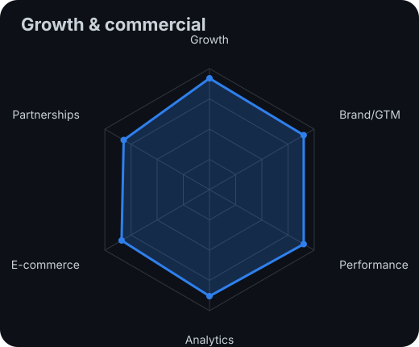
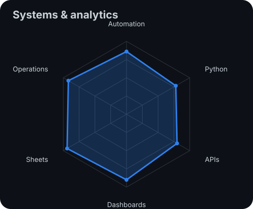
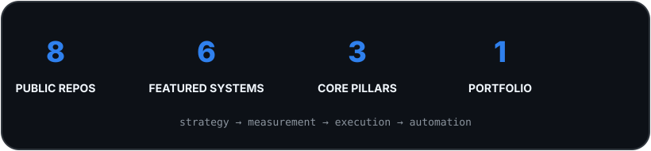
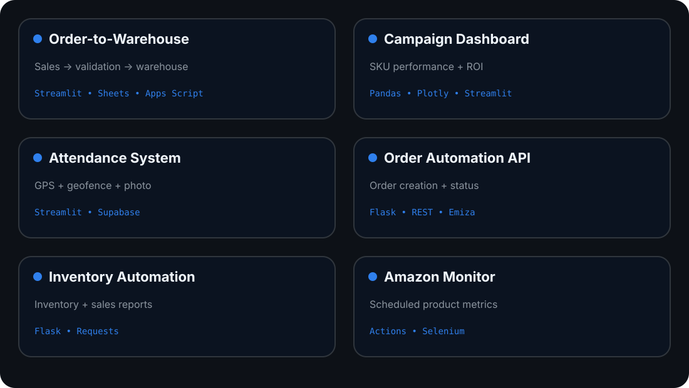

<div align="center">

<!-- LIVE PORTRAIT — generated-style reveal on profile load -->


<br>

<a href="https://github.com/anshdutta26-code">
  
</a>

<br>

<a href="https://anshdutta.com"></a>
<a href="https://www.linkedin.com/in/ansh-dutta/"></a>
<a href="mailto:anshdutta26@gmail.com"></a>

<br><br>


</div>

---

## `~/` whoami

```console
$ cat operator.txt
```

Hi, I'm **Ansh Dutta**. I work where **growth, brand strategy, commercial execution, analytics and automation** overlap.

I use data to understand what is happening, business context to decide what matters, and practical systems to make execution faster and more measurable.

- Building across **growth marketing, GTM, performance, e-commerce and analytics**
- Designing **automation and internal tools** for real operational workflows
- Turning campaign, retail and operations data into **management-level decision systems**
- Portfolio: **[anshdutta.com](https://anshdutta.com)**

> `strategy → measurement → execution → automation → learning loop`

---

<div align="center">

## `~/` toolbox


<br><br>


</div>

---

<div align="center">

## `~/` capability radar

<table>
<tr>
<td width="50%" align="center" valign="middle">
<picture>
  <source media="(prefers-color-scheme: dark)" srcset="assets/radar-growth-dark.svg">
  <source media="(prefers-color-scheme: light)" srcset="assets/radar-growth-light.svg">
  
</picture>
</td>
<td width="50%" align="center" valign="middle">
<picture>
  <source media="(prefers-color-scheme: dark)" srcset="assets/radar-systems-dark.svg">
  <source media="(prefers-color-scheme: light)" srcset="assets/radar-systems-light.svg">
  
</picture>
</td>
</tr>
</table>

</div>

---

<div align="center">

## `~/` build signals

<picture>
  <source media="(prefers-color-scheme: dark)" srcset="assets/profile-stats-dark.svg">
  <source media="(prefers-color-scheme: light)" srcset="assets/profile-stats-light.svg">
  
</picture>

<br><br>


<br><br>


</div>

---

<div align="center">

## `~/` selected systems

<picture>
  <source media="(prefers-color-scheme: dark)" srcset="assets/project-grid-dark.svg">
  <source media="(prefers-color-scheme: light)" srcset="assets/project-grid-light.svg">
  
</picture>

</div>

| project | process | repository |
|---|---|---|
| **Order-to-Warehouse Automation** | `sales → validation → warehouse` | **[open →](https://github.com/anshdutta26-code/Order-to-Warehouse-Automation)** |
| **Campaign Metrics Dashboard** | `campaign data → SKU KPIs → decision view` | **[open →](https://github.com/anshdutta26-code/campaign-dashboard)** |
| **GPS & Photo Attendance System** | `login → GPS → geofence → photo → Supabase` | **[open →](https://github.com/anshdutta26-code/attendance-app)** |
| **Multi-Warehouse Order API** | `request → routing → Atlas → Order ID/status` | **[open →](https://github.com/anshdutta26-code/order-automation)** |
| **Inventory Automation API** | `warehouse → report API → inventory/sales output` | **[open →](https://github.com/anshdutta26-code/INVENTORY-AUTOMATION)** |
| **Amazon Product Monitor** | `queries → Actions → browser → parser → workbook` | **[open →](https://github.com/anshdutta26-code/amazon-scraper)** |

---

<div align="center">

## `~/` strategy & case-study library

<table>
<tr>
<td width="50%" valign="top">

### ₹100 Cr Fundraising Readiness
Financial modelling, P&L, forecasting and investor-readiness support.

**[View case study ↗](https://docs.google.com/document/d/1OMAsaB850PBwP7sPCvTn8zEuuXMrJyV5/preview)**

</td>
<td width="50%" valign="top">

### Ontario Science Centre Rebranding
Brand positioning and integrated marketing communications strategy.

**[View case study ↗](https://docs.google.com/document/d/15R4ENCu6ASdX9qjv-9WEgIOMfO46WNNj/preview)**

</td>
</tr>
<tr>
<td width="50%" valign="top">

### Sales Allowance & TADA Automation
Policy-led travel-expense and allowance workflow automation.

**[View case study ↗](https://docs.google.com/document/d/12OL1rkm4-9iU1H-sKG5HrmcDmmkrUQ8r/preview)**

</td>
<td width="50%" valign="top">

### Infinity Flex Marketing Strategy
STP, marketing mix, competitor analysis, digital strategy and KPIs.

**[View case study ↗](https://docs.google.com/document/d/1bi4N9sX5fDvvalCqu9h_S0ZFWbegWZmw/preview)**

</td>
</tr>
<tr>
<td width="50%" valign="top">

### Xbox vs PlayStation Brand Strategy
Competitive positioning, audience, digital presence and growth analysis.

**[View case study ↗](https://docs.google.com/document/d/1_0qivU7jjC6TWz6ab5xJh3GzBojKbumR/preview)**

</td>
<td width="50%" valign="top">

### Full Portfolio Project Library
Visual project overviews, architecture-led systems and detailed case studies.

**[Explore projects ↗](https://anshdutta.com/projects/)**

</td>
</tr>
</table>

</div>

---

## `~/` how I build

```text
01  Understand the business problem
          ↓
02  Map the customer / process / data flow
          ↓
03  Define the KPI, validation or operating rule
          ↓
04  Build the dashboard, automation or integration
          ↓
05  Put the output back into the team's workflow
          ↓
06  Measure, learn and improve
```

My repositories are intentionally documented around **process and architecture**, not only code. The goal is to show how a technical implementation connects to a real commercial or operational problem.

---

<div align="center">

## `~/` connect

**Growth Marketing · Brand Strategy · GTM · Analytics · Automation**

<br>

<a href="https://anshdutta.com"></a>

<br><br>

<sub>`01100010 01110101 01101001 01101100 01100100 00100000 00101101 00111110 00100000 01101101 01100101 01100001 01110011 01110101 01110010 01100101 00100000 00101101 00111110 00100000 01101001 01101101 01110000 01110010 01101111 01110110 01100101`</sub>

</div>
